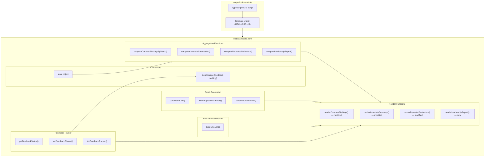

# Design Document — Dashboard Email Automation & Enhancements

## Overview

This design covers five enhancements to the existing static HTML dashboard generated by `scripts/build-static.ts`. All changes are implemented as new or modified JavaScript functions inside the template literal that produces `dist/dashboard.html`. There is no server, no framework runtime — everything runs client-side in vanilla JS embedded in a single HTML file.

The enhancements are:

1. **Week-wise Common Findings** — Restructure `computeCommonFindings()` and `renderCommonFindings()` to group findings by `transactionWeek` first, then by quality attribute within each week.
2. **Email Automation** — Add `buildMailtoLink()`, appreciation/feedback buttons in `renderAssociateSummary()`, and a `mailto:` link generator that pre-fills Outlook emails.
3. **Feedback Tracking** — A `localStorage`-based state machine that tracks per-associate email sharing status (Pending → Shared) scoped to manager + week.
4. **EMS Portal Deep-Linking** — Add EMS buttons to `renderRepeatedDefaulters()` that open SharePoint EMS forms with pre-filled query parameters.
5. **Leadership Report** — An admin-only section with cross-region analysis, manager comparison, and clipboard/CSV export.

### Key Design Decisions

1. **All code stays in the template literal** — No external JS files, no build-time modules. New functions are added alongside existing ones in the `<script>` block of `build-static.ts`.
2. **`mailto:` for email** — Uses browser-native `mailto:` URIs instead of an email API. This works reliably on corporate Windows machines with Outlook as the default mail client. No SMTP, no SES.
3. **`localStorage` for feedback tracking** — Persists per-browser, scoped by manager login + week number. No server-side state. Key format: `feedback_{managerLogin}_wk{weekNumber}`.
4. **URI length limit handling** — `mailto:` URIs are capped at ~2000 characters. The body is truncated with a note if it exceeds this limit.
5. **EMS uses query parameters** — The SharePoint EMS form accepts pre-filled fields via URL query parameters. The link opens in a new tab.
6. **Week 15 cutoff for feedback tracking** — Feedback status indicators only appear for Week 15+ data, since the feature didn't exist before that.

## Architecture



### Data Flow

1. User logs in → `state.user` is set with login and role.
2. Filters are applied → `getFilteredRecords()` returns scoped `AuditRecord[]`.
3. Aggregation functions compute summaries from filtered records.
4. Render functions produce HTML strings, now including email buttons, feedback status badges, and EMS links.
5. When a user clicks an email button → `buildMailtoLink()` constructs a `mailto:` URI → browser opens Outlook → `setFeedbackShared()` updates `localStorage`.
6. On re-render, `getFeedbackStatus()` reads `localStorage` to restore badge state.

## Components and Interfaces

### 1. Common Findings by Week — `computeCommonFindingsByWeek(records)`

Replaces the existing `computeCommonFindings()` aggregation to group by week first.

```typescript
interface WeekFindings {
  week: number;
  groups: { attribute: string; findings: { finding: string; count: number }[] }[];
  totalDistinctFindings: number;
}

function computeCommonFindingsByWeek(records: AuditRecord[]): WeekFindings[]
// Returns an array sorted by week ascending.
// Each entry contains findings grouped by attribute, sorted by descending count.
// Weeks with zero error findings are omitted.
```

The existing `renderCommonFindings()` is modified to iterate over weeks, rendering each as a collapsible subsection with a "Week {N}" header. When only a single week is in scope, the week header wrapper is omitted.

### 2. Mailto Link Generator — `buildMailtoLink(to, subject, body)`

A pure utility function that constructs a properly encoded `mailto:` URI.

```typescript
function buildMailtoLink(to: string, subject: string, body: string): string
// Returns: "mailto:{to}?subject={encoded}&body={encoded}"
// Encodes subject and body with encodeURIComponent.
// Line breaks in body are encoded as %0D%0A.
// If total URI length > 2000, truncates body and appends "[Content truncated]".
```

### 3. Appreciation Email Builder — `buildAppreciationEmail(associate, records, weekNumber)`

Composes the subject and body for a zero-defect appreciation email.

```typescript
interface EmailContent {
  to: string;
  subject: string;
  body: string;
}

function buildAppreciationEmail(
  associateLogin: string,
  records: AuditRecord[],  // filtered to this associate's records in scope
  weekNumber: number        // most recent week in selection
): EmailContent
```

Subject format: `Appreciation — 0% Defect Rate — Week {weekNumber}`

Body includes:
- Greeting with associate login
- Number of audits monitored
- Transaction dates (case IDs)
- Disruption types audited
- Week number
- Congratulatory message

### 4. Feedback Email Builder — `buildFeedbackEmail(associate, records, defectRate, weekNumber)`

Composes the subject and body for a defect feedback email.

```typescript
function buildFeedbackEmail(
  associateLogin: string,
  records: AuditRecord[],  // filtered to this associate's records in scope
  defectRate: number,
  weekNumber: number
): EmailContent
```

Subject format: `Quality Feedback — Defect Rate {rate}% — Week {weekNumber}`

Body includes:
- Greeting with associate login
- Defect rate and audit count
- Transaction dates (case IDs)
- Disruption types
- Week number
- Error details: each failed attribute with its auditor finding text
- Guidance note

### 5. Feedback Tracker — `getFeedbackStatus()`, `setFeedbackShared()`, `initFeedbackTracker()`

Client-side state management using `localStorage`.

```typescript
// localStorage key format: "feedback_{managerLogin}_wk{weekNumber}"
// Value: JSON object mapping associateLogin → "Pending" | "Shared"

function getFeedbackStatus(managerLogin: string, weekNumber: number): Record<string, string>
// Reads localStorage, returns the status map. Returns {} if not found.

function setFeedbackShared(managerLogin: string, weekNumber: number, associateLogin: string): void
// Updates the associate's status to "Shared" in localStorage.

function initFeedbackTracker(managerLogin: string, weekNumber: number, associateLogins: string[]): void
// Initializes all associates to "Pending" if no entry exists for this manager+week.
// Does NOT overwrite existing entries (preserves "Shared" status).
```

Display rules:
- Week < 15: No feedback status indicators shown.
- Current week (most recent in data): Show "Pending" (orange) or "Shared" (green) badges.
- Previous weeks (≥ 15): Show "Completed" (gray) badge for all associates.

### 6. EMS Link Builder — `buildEmsLink(associate, records, weekNumber)`

Constructs a SharePoint EMS form URL with pre-filled query parameters.

```typescript
function buildEmsLink(
  associateLogin: string,
  records: AuditRecord[],  // defect records for this associate
  weekNumber: number
): string
// Returns full URL with query parameters:
//   - Team: "OB"
//   - Week: "Week{number}"
//   - Associate: associateLogin
//   - Manager: supervisorLogin (from first record)
//   - Region: region (from first record)
//   - Category: "Performance"
//   - CaseWIMsID: comma-separated transaction dates
//   - Summary: feedback text with failed attributes and findings
//   - SkipManager: "" (empty, for manual selection)
// Base URL: https://share.amazon.com/sites/EMS%202.0/Lists/EMS%2020/Item/newifs.aspx
```

### 7. Leadership Report — `computeLeadershipReport()`, `renderLeadershipReport()`

Admin-only section with cross-region analysis.

```typescript
interface LeadershipReport {
  regionSummary: {
    region: string;
    weeks: { week: number; audited: number; defects: number; rate: number }[];
    trend: 'improving' | 'regressing' | 'stable';
  }[];
  managerComparison: {
    manager: string;
    audited: number;
    defects: number;
    rate: number;
  }[];
  repeatedDefaulters: { login: string; weeksWithDefects: number }[];
  bestPractices: string[];
}

function computeLeadershipReport(records: AuditRecord[]): LeadershipReport
// Uses ALL records (admin has no filter), computes cross-region data.

function renderLeadershipReport(report: LeadershipReport): string
// Returns HTML with tables for each section.

function copyLeadershipReport(): void
// Formats report as plain text, copies to clipboard via navigator.clipboard.writeText().
// Shows "Copied!" confirmation for 2 seconds, or error message on failure.

function exportLeadershipCsv(report: LeadershipReport): void
// Downloads a CSV file with the tabular data sections.
```

### 8. Modified Render Functions

**`renderAssociateSummary(summaries, repeatedDefaulters)`** — Modified to add:
- "Appreciate" button (green) for rows with 0% defect rate (manager/admin only)
- "Feedback" button (orange) for rows with >0% defect rate (manager/admin only)
- Feedback status badge (Pending/Shared/Completed) next to each associate (manager/admin only, week ≥ 15)
- New "Actions" column in the table header

**`renderRepeatedDefaulters(defaulters)`** — Modified to add:
- "EMS" button (red) next to each defaulter row (manager/admin only)
- New "Actions" column in the table header

**`renderCommonFindings(findingsByWeek)`** — Modified to:
- Accept `WeekFindings[]` instead of the old `CommonFindingsResult`
- Render week-grouped subsections with "Week {N}" headers
- Skip week header when only one week is in scope

**`renderDashboard()`** — Modified to:
- Call `computeCommonFindingsByWeek()` instead of `computeCommonFindings()`
- Add `renderLeadershipReport()` call for admin users
- Add "Leadership Report" tab in admin nav

**`renderNav()`** — Modified to add a "Leadership Report" nav link for admin users.

### 9. State Changes

The `state` object gets one new field:

```typescript
let state = {
  // ... existing fields ...
  currentView: 'dashboard' | 'rawdata' | 'leadership',  // add 'leadership'
};
```

## Data Models

### New Types (all inline in the template literal)

```typescript
/** Email content ready for mailto link generation. */
interface EmailContent {
  to: string;      // e.g., "moizu@amazon.com"
  subject: string; // plain text, will be URI-encoded
  body: string;    // plain text with \r\n line breaks, will be URI-encoded
}

/** Common findings grouped by week, then by attribute. */
interface WeekFindings {
  week: number;
  groups: {
    attribute: string;
    findings: { finding: string; count: number }[];
  }[];
  totalDistinctFindings: number;
}

/** Leadership report data structure. */
interface LeadershipReport {
  regionSummary: {
    region: string;
    weeks: { week: number; audited: number; defects: number; rate: number }[];
    trend: 'improving' | 'regressing' | 'stable';
  }[];
  managerComparison: {
    manager: string;
    audited: number;
    defects: number;
    rate: number;
  }[];
  repeatedDefaulters: { login: string; weeksWithDefects: number }[];
  bestPractices: string[];
}
```

### Existing Types Used (from inline JS in build-static.ts)

These are the compact record shapes already in the template literal:

- Audit record (expanded from `RAW_DATA`): `{ region, transactionWeek, transactionDate, associateLogin, supervisorLogin, disruptionType, adm, admFinding, ra, raFinding, rrc, rrcFinding, acc, accFinding, rv, rvFinding, defectFlag }`
- Associate summary (from `computeAssociateSummaries()`): `{ associateLogin, totalAudits, totalDefects, defectRate, errorAttributes, topFindings, trend }`
- Repeated defaulter (from `computeRepeatedDefaulters()`): `{ associateLogin, totalWeeksWithDefects, weeklyDefects }`

### localStorage Schema

```
Key:    "feedback_{managerLogin}_wk{weekNumber}"
Value:  JSON string of { [associateLogin: string]: "Pending" | "Shared" }

Example:
  Key:   "feedback_mkumrtq_wk17"
  Value: '{"moizu":"Shared","anilk":"Pending","rajeshv":"Shared"}'
```


## Correctness Properties

*A property is a characteristic or behavior that should hold true across all valid executions of a system — essentially, a formal statement about what the system should do. Properties serve as the bridge between human-readable specifications and machine-verifiable correctness guarantees.*

### Property 1: Week-wise Findings Grouping and Counting

*For any* array of audit records with error findings, `computeCommonFindingsByWeek()` SHALL produce a `WeekFindings[]` where: (a) each finding appears under the correct `transactionWeek` and correct quality attribute group, (b) each finding's count equals its actual number of occurrences in that week for that attribute, and (c) weeks with zero error findings are omitted from the output.

**Validates: Requirements 1.1, 1.2, 1.7**

### Property 2: Week-wise Findings Sort Order

*For any* output of `computeCommonFindingsByWeek()`, the week entries SHALL be sorted in ascending order by week number, and within each week's attribute group, findings SHALL be sorted in descending order by frequency count.

**Validates: Requirements 1.4, 1.5**

### Property 3: Mailto Link Round-Trip Encoding

*For any* valid `EmailContent` object (with arbitrary recipient, subject, and body strings including special characters, line breaks, ampersands, equals signs, and Unicode), generating a mailto link with `buildMailtoLink()` and then parsing the URI to extract and `decodeURIComponent` the subject and body parameters SHALL produce strings equal to the original subject and body.

**Validates: Requirements 8.3, 8.1, 8.2, 3.6**

### Property 4: Mailto Link Truncation

*For any* email body string exceeding 2000 characters, `buildMailtoLink()` SHALL produce a URI whose total length does not exceed 2000 characters, and the decoded body SHALL end with a truncation indicator note.

**Validates: Requirements 8.5**

### Property 5: Appreciation Email Content

*For any* associate login, non-empty array of audit records for that associate, and set of selected weeks, `buildAppreciationEmail()` SHALL produce an `EmailContent` where: (a) `to` equals `{associateLogin}@amazon.com`, (b) `subject` contains the format `Appreciation — 0% Defect Rate — Week {maxWeek}` using the most recent week, and (c) `body` contains the audit count, all transaction dates from the records, the disruption types, and the week number.

**Validates: Requirements 2.2, 2.3, 2.4, 2.6**

### Property 6: Feedback Email Content

*For any* associate login, non-empty array of audit records containing at least one defect, defect rate, and week number, `buildFeedbackEmail()` SHALL produce an `EmailContent` where: (a) `to` equals `{associateLogin}@amazon.com`, (b) `subject` contains the format `Quality Feedback — Defect Rate {rate}% — Week {weekNumber}`, and (c) `body` contains the defect rate, audit count, transaction dates, disruption types, week number, and for each failed quality attribute, the attribute name and its auditor finding text.

**Validates: Requirements 3.2, 3.3, 3.4**

### Property 7: Feedback Tracker State Machine

*For any* manager login, week number, and array of associate logins: (a) after calling `initFeedbackTracker()`, `getFeedbackStatus()` SHALL return "Pending" for every associate, (b) after calling `setFeedbackShared()` for a specific associate, `getFeedbackStatus()` SHALL return "Shared" for that associate and "Pending" for all others, and (c) the localStorage key SHALL match the format `feedback_{managerLogin}_wk{weekNumber}`.

**Validates: Requirements 4.2, 4.3, 4.4, 4.5, 4.8**

### Property 8: EMS Link Correctness

*For any* associate login, non-empty array of defect records, and week number, `buildEmsLink()` SHALL produce a URL where: (a) the base URL starts with `https://share.amazon.com/sites/EMS%202.0/Lists/EMS%2020/Item/newifs.aspx`, (b) query parameters include Team="OB", Week="Week{number}", Associate=associateLogin, Manager=supervisorLogin, Region=region, and Category="Performance", (c) the Case/WIMs ID parameter contains the transaction dates from the defect records, and (d) the Summary parameter contains the failed quality attributes and their auditor findings.

**Validates: Requirements 5.2, 5.3, 5.4, 5.5**

### Property 9: Leadership Report Region Summary

*For any* array of audit records spanning multiple regions and weeks, `computeLeadershipReport()` SHALL produce a `regionSummary` where: (a) each distinct region appears with per-week entries whose `audited`, `defects`, and `rate` values match independently computed values for that region+week, and (b) the `trend` direction is "improving" when the last 4 weeks show a decreasing defect rate, "regressing" when increasing, and "stable" otherwise.

**Validates: Requirements 6.3, 6.6**

### Property 10: Leadership Report Manager Comparison

*For any* array of audit records with multiple supervisors, `computeLeadershipReport()` SHALL produce a `managerComparison` where each entry's `audited` equals the count of records for that supervisor, `defects` equals the count of defect records for that supervisor, and `rate` equals `round((defects / audited) * 100, 2)`.

**Validates: Requirements 6.4**

### Property 11: Leadership Report Plain Text Formatting

*For any* valid `LeadershipReport` object, the plain text formatting function SHALL produce a string that contains: section headers for region summary, manager comparison, repeated defaulters, and best practices; and for each region and manager entry, the corresponding data values from the report.

**Validates: Requirements 7.3**

## Error Handling

### Mailto Link Errors

| Error Condition | Handling |
|----------------|----------|
| Email body exceeds 2000 characters | Truncate body, append `[Content truncated — please refer to the dashboard for full details]` |
| Associate login contains special characters | `encodeURIComponent` handles all URI-unsafe characters |
| Empty records array for email builder | Return email with "No audit records found for this period" in body |
| Browser blocks `mailto:` (popup blocker) | No programmatic workaround; `window.location.href = mailtoLink` is used which is not blocked by popup blockers |

### Feedback Tracker Errors

| Error Condition | Handling |
|----------------|----------|
| `localStorage` is full | Catch `QuotaExceededError`, display warning "Unable to save feedback status" |
| `localStorage` is disabled (private browsing) | Catch error on read/write, fall back to in-memory state for current session |
| Corrupted JSON in `localStorage` | Catch `JSON.parse` error, reinitialize to all "Pending" |
| Week number is undefined (no data loaded) | Skip feedback tracker initialization, hide status indicators |

### EMS Link Errors

| Error Condition | Handling |
|----------------|----------|
| No defect records for associate | Hide EMS button (only shown for repeated defaulters who have defects by definition) |
| Missing supervisor login in records | Use empty string for Manager parameter |
| URL exceeds browser URL length limit (~2083 chars in IE/Edge) | Truncate Summary parameter, append truncation note |

### Clipboard API Errors

| Error Condition | Handling |
|----------------|----------|
| `navigator.clipboard` not available (HTTP, older browsers) | Show error: "Copy failed — please select the text manually and use Ctrl+C" |
| `writeText()` promise rejects | Show error message near button for 3 seconds |
| Permission denied | Show error message suggesting manual copy |

### Leadership Report Errors

| Error Condition | Handling |
|----------------|----------|
| No records available | Show "No data available for leadership report" message |
| Single region only | Show report with one region, omit cross-region comparison language |
| Fewer than 4 weeks of data | Compute trend with available weeks, note "Limited data" in trend section |

## Testing Strategy

### Property-Based Tests (fast-check)

The project uses `fast-check` (v3.22.0) with Vitest. Each correctness property maps to a single property-based test with a minimum of 100 iterations.

Since all new logic lives inside the template literal of `build-static.ts`, the property tests will extract the pure functions into a testable module. The approach:

1. Create a shared test helper that extracts the pure function implementations (e.g., `computeCommonFindingsByWeek`, `buildMailtoLink`, `buildAppreciationEmail`, `buildFeedbackEmail`, `buildEmsLink`, feedback tracker functions, `computeLeadershipReport`, `formatLeadershipReportText`) into importable functions that mirror the inline implementations.
2. These extracted functions are tested with fast-check generators.

**Test file:** `src/services/__tests__/email-automation.property.test.ts`

| Property | Test Description | Generator Strategy |
|----------|-----------------|-------------------|
| Property 1 | Week-wise findings grouping | Generate `AuditRecord[]` with random weeks (1–52), random attributes ("Yes"/"No"), random finding texts. Verify grouping and counts. |
| Property 2 | Week-wise findings sort order | Same generator as Property 1. Verify week order and within-group count order. |
| Property 3 | Mailto round-trip encoding | Generate random `EmailContent` with `fc.string()` for subject/body including special chars (`&`, `=`, `\r\n`, Unicode). Build mailto, parse, decode, compare. |
| Property 4 | Mailto truncation | Generate `fc.string({ minLength: 2001 })` for body. Verify URI length ≤ 2000 and truncation note present. |
| Property 5 | Appreciation email content | Generate random login (`fc.stringMatching(/[a-z]{3,10}/)`), random `AuditRecord[]`, random week numbers. Verify email fields. |
| Property 6 | Feedback email content | Generate random login, `AuditRecord[]` with defects, random rate, random week. Verify email fields including error details. |
| Property 7 | Feedback tracker state machine | Generate random manager login, week number, array of associate logins. Mock `localStorage`. Verify init→Pending, setShared→Shared, key format. |
| Property 8 | EMS link correctness | Generate random login, defect `AuditRecord[]`, week number. Parse URL, verify all query parameters. |
| Property 9 | Leadership report region summary | Generate `AuditRecord[]` with random regions ("NA"/"EU"), multiple weeks. Verify per-region per-week counts and trend direction. |
| Property 10 | Leadership report manager comparison | Generate `AuditRecord[]` with random supervisor logins. Verify per-manager metrics. |
| Property 11 | Leadership report text formatting | Generate random `LeadershipReport` objects. Verify formatted text contains all section headers and data values. |

**Tag format:** Each test includes a comment: `// Feature: dashboard-email-automation, Property N: <title>`

### Unit Tests (example-based)

Example-based tests cover UI rendering rules and role-based visibility:

- Appreciate button appears for 0% defect rate rows (manager/admin only) — Requirements 2.1, 2.5
- Feedback button appears for >0% defect rate rows (manager/admin only) — Requirements 3.1, 3.5
- No email buttons for associate role — Requirements 2.5, 3.5
- Feedback status indicators appear for manager/admin — Requirement 4.1
- No feedback indicators for weeks < 15 — Requirement 4.6
- "Completed" status for past weeks ≥ 15 — Requirement 4.7
- EMS button appears for repeated defaulters (manager/admin only) — Requirements 5.1, 5.8
- No EMS button for associate role — Requirement 5.8
- SkipManager field is empty in EMS link — Requirement 5.6
- EMS base URL matches expected constant — Requirement 5.7
- Leadership Report visible for admin only — Requirements 6.1, 6.2
- Leadership Report includes best practices — Requirement 6.7
- Copy to Clipboard button present — Requirement 7.1
- Export CSV button present — Requirement 7.6
- Clipboard failure shows error message — Requirement 7.5
- Single-week findings render without week header — Requirement 1.6
- Multi-week findings render with week headers — Requirement 1.3
- Common findings visible for all roles — Requirement 1.8

### Integration Tests

- Full email flow: click Appreciate button → verify `window.location.href` is set to valid mailto URI → verify feedback tracker updates to "Shared"
- Clipboard copy flow: mock `navigator.clipboard.writeText` → click Copy → verify called with formatted text → verify "Copied!" confirmation appears
- localStorage persistence: set feedback status → clear DOM → re-render → verify status restored
