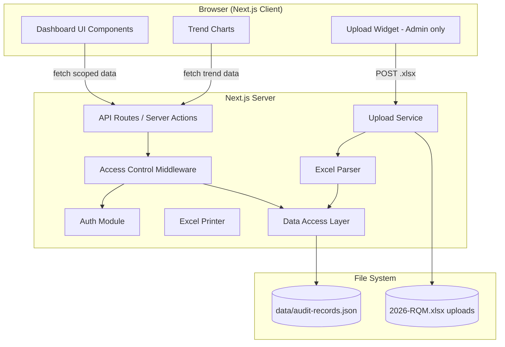
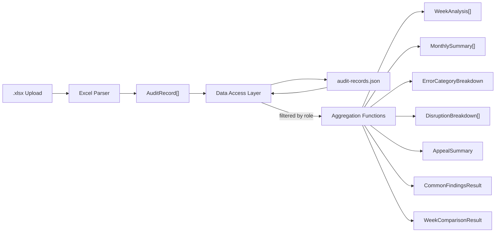

# Design Document — Quality Performance Dashboard

## Overview

The Quality Performance Dashboard is a self-service Next.js web application that surfaces RQM (Quality Monitoring) audit data to three user roles: Admin, Manager, and Associate. The admin uploads weekly Excel files containing raw audit records; the system parses, validates, and persists them. Each role sees a scoped view of defect rates, error attribute breakdowns, common findings, best practices, disruption breakdowns, appeal summaries, and week-over-week comparisons.

The system builds on the existing TypeScript/Vitest project, reusing the `AuditRecord` data model in `src/models/audit-types.ts` and following the adapter pattern established in `src/adapters/`. The dashboard is a Next.js 14 app with server-side data access, client-side charting, and role-based access control.

### Key Design Decisions

1. **File-based persistence** — Parsed audit records are stored as a JSON file on disk (`data/audit-records.json`) rather than a database. This keeps the stack simple for a single-admin, low-write-frequency workload. The Upload Service reads/writes this file atomically.
2. **Server-side access control** — All data filtering happens in API routes / server actions, never on the client. The client receives only the records the user is authorized to see.
3. **Excel adapter pattern** — The Excel parser and printer follow the same adapter interface pattern as `QuipAdapter` and `SharePointAdapter`, with a pure parsing function and a class wrapper.
4. **Reuse of existing types** — `AuditRecord`, `WeekAnalysis`, `ErrorCategoryBreakdown`, `DisruptionBreakdown`, `AppealSummary`, and `DefectAvoidanceEntry` from `src/models/audit-types.ts` are used directly. New types are added only where the existing model is insufficient.

## Architecture



### Request Flow

1. User authenticates → `Auth` module resolves role (Admin / Manager / Associate).
2. Client requests data → API route invokes `Access Control` which injects a filter predicate based on role.
3. `Data Access Layer` reads `audit-records.json`, applies the filter, and returns scoped `AuditRecord[]`.
4. API route passes scoped records to aggregation functions (weekly summary, error breakdown, etc.) and returns JSON.
5. Client renders charts and tables.

### Upload Flow

1. Admin POSTs `.xlsx` file → `Upload Service` validates file type.
2. `Excel Parser` converts rows to `AuditRecord[]`, collecting parse warnings.
3. `Upload Service` merges new records with existing dataset (upsert by composite key: `associateLogin` + `transactionDate` + `transactionWeek`).
4. Merged dataset is written atomically to `data/audit-records.json`.
5. Response includes parsed count, skipped count, and warnings.

## Components and Interfaces

### 1. Auth Module (`src/auth/`)

Determines user role from session/credentials.

```typescript
type UserRole = 'admin' | 'manager' | 'associate';

interface AuthenticatedUser {
  login: string;
  email: string;
  role: UserRole;
}

interface AuthModule {
  /** Resolves the authenticated user from the request context. Returns null if unauthenticated. */
  getUser(request: Request): Promise<AuthenticatedUser | null>;
}
```

Role mapping is driven by a config file (`data/role-mapping.json`) that the admin maintains. If a login is not in the mapping, the system defaults to `associate` role using the login as `associateLogin`.

### 2. Access Control (`src/access-control/`)

Returns a filter predicate based on the user's role.

```typescript
type RecordFilter = (record: AuditRecord) => boolean;

interface AccessControl {
  /** Returns a predicate that keeps only records the user is authorized to see. */
  getFilter(user: AuthenticatedUser): RecordFilter;
}
```

| Role | Filter Logic |
|------|-------------|
| Admin | `() => true` — no filtering |
| Manager | `(r) => r.supervisorLogin === user.login` |
| Associate | `(r) => r.associateLogin === user.login` |

### 3. Data Access Layer (`src/data/`)

Reads and writes the persisted audit records.

```typescript
interface DataAccess {
  /** Returns all audit records, optionally filtered. */
  getRecords(filter?: RecordFilter): Promise<AuditRecord[]>;
  /** Upserts records: replaces matching keys, appends new ones. Returns merge stats. */
  upsertRecords(records: AuditRecord[]): Promise<{ added: number; replaced: number }>;
}
```

Composite key for upsert: `associateLogin` + `transactionDate` + `transactionWeek`.

### 4. Excel Adapter (`src/adapters/excel-adapter.ts`)

Follows the existing adapter pattern.

```typescript
interface ExcelParseResult {
  records: AuditRecord[];
  warnings: ExcelParseWarning[];
  totalRows: number;
}

interface ExcelParseWarning {
  rowNumber: number;
  missingFields: string[];
}

interface ExcelAdapter {
  /** Parses an .xlsx buffer into AuditRecord objects. */
  parse(buffer: Buffer): ExcelParseResult;
  /** Serializes AuditRecord objects into an .xlsx buffer. */
  print(records: AuditRecord[]): Buffer;
}
```

### 5. Upload Service (`src/services/upload-service.ts`)

Orchestrates file validation, parsing, and persistence.

```typescript
interface UploadResult {
  success: boolean;
  parsedCount: number;
  skippedCount: number;
  warnings: ExcelParseWarning[];
  mergeStats: { added: number; replaced: number };
  error?: string;
}

interface UploadService {
  processUpload(file: Buffer, filename: string): Promise<UploadResult>;
}
```

### 6. Aggregation Functions (`src/services/aggregation.ts`)

Pure functions that compute dashboard views from a scoped `AuditRecord[]`.

```typescript
function computeWeeklySummary(records: AuditRecord[]): WeekAnalysis[];
function computeMonthlySummary(records: AuditRecord[]): MonthlySummary[];
function computeErrorBreakdown(records: AuditRecord[], week?: number): ErrorCategoryBreakdown;
function computeDisruptionBreakdown(records: AuditRecord[], week?: number): DisruptionBreakdown[];
function computeAppealSummary(records: AuditRecord[]): AppealSummary;
function computeCommonFindings(records: AuditRecord[]): CommonFindingsResult;
function computeWeekComparison(records: AuditRecord[], weekA: number, weekB: number): WeekComparisonResult;
function computeDefectRate(totalDefects: number, totalAudited: number): number;
```

### 7. Dashboard UI Components (`src/app/dashboard/`)

Next.js pages and React components.

| Component | Description |
|-----------|-------------|
| `DashboardLayout` | Shell with nav, role indicator, filters |
| `PerformanceSummary` | Weekly/monthly defect rate cards |
| `TrendChart` | Line chart for defect rate over time (weekly + monthly) |
| `ErrorBreakdownChart` | Bar chart of attribute error frequencies |
| `ErrorDetailTable` | Filterable table of individual error records (associate view) |
| `CommonFindingsPanel` | Grouped findings by attribute with frequency |
| `BestPracticesPanel` | Defect avoidance guidance grouped by category |
| `WeekComparisonView` | Side-by-side week comparison with delta indicators |
| `DisruptionBreakdownTable` | Defect counts by disruption/sub-disruption type |
| `AppealSummaryCard` | Appeal counts and acceptance rate |
| `AdminUploadPanel` | File upload widget with result summary |

## Data Models

### Existing Types (from `src/models/audit-types.ts`)

The following types are reused directly:

- `AuditRecord` — core row model, one per audited transaction
- `WeekAnalysis` — weekly aggregation (week, totalAudited, totalErrors, totalDefects)
- `ErrorCategoryBreakdown` — attribute error + defect reason frequencies
- `DisruptionBreakdown` — defect counts by disruption type
- `AppealSummary` — appeal outcome counts and acceptance rate
- `DefectAvoidanceEntry` — avoidance guidance grouped by category

### New Types

```typescript
/** Monthly aggregation of audit data. */
interface MonthlySummary {
  /** Month number (1-12). */
  month: number;
  /** Year (e.g. 2026). */
  year: number;
  /** Total records audited in this month. */
  totalAudited: number;
  /** Total confirmed defects in this month. */
  totalDefects: number;
  /** Total error attribute count in this month. */
  totalErrors: number;
  /** Defect rate as percentage, rounded to 2 decimal places. */
  defectRate: number;
}

/** Result of comparing two Transaction Weeks. */
interface WeekComparisonResult {
  weekA: { week: number; summary: WeekAnalysis; breakdown: ErrorCategoryBreakdown };
  weekB: { week: number; summary: WeekAnalysis; breakdown: ErrorCategoryBreakdown };
  /** Defect rate delta (weekB - weekA) in percentage points. */
  defectRateDelta: number;
  /** 'improvement' if delta < 0, 'regression' if delta > 0, 'unchanged' if 0. */
  direction: 'improvement' | 'regression' | 'unchanged';
}

/** Grouped auditor findings for the Common Findings panel. */
interface CommonFindingsResult {
  /** Findings grouped by quality attribute. */
  groups: {
    attribute: string;
    findings: { finding: string; count: number }[];
  }[];
  /** Total distinct findings across all attributes. */
  totalDistinctFindings: number;
}

/** A single error record for the Associate Error Detail table. */
interface ErrorDetailRecord {
  transactionWeek: number;
  transactionDate: string;
  disruptionType: string;
  failedAttributes: string[];
  findings: { attribute: string; finding: string }[];
}

/** Role mapping entry for auth configuration. */
interface RoleMappingEntry {
  login: string;
  role: UserRole;
}
```

### Data Flow Diagram




## Correctness Properties

*A property is a characteristic or behavior that should hold true across all valid executions of a system — essentially, a formal statement about what the system should do. Properties serve as the bridge between human-readable specifications and machine-verifiable correctness guarantees.*

### Property 1: Role Resolution

*For any* login string and any valid role mapping configuration, the Auth module SHALL resolve the user's role to exactly the role specified in the mapping, or default to `associate` if the login is not present in the mapping.

**Validates: Requirements 1.1**

### Property 2: Access Control Filter Correctness

*For any* array of AuditRecords and any authenticated user:
- If the user's role is `associate`, the filter SHALL return exactly those records where `associateLogin === user.login` and no others.
- If the user's role is `manager`, the filter SHALL return exactly those records where `supervisorLogin === user.login` and no others.
- If the user's role is `admin`, the filter SHALL return all records unmodified.

**Validates: Requirements 2.1, 2.2, 3.1, 4.1**

### Property 3: Weekly Summary Invariants

*For any* array of AuditRecords, `computeWeeklySummary` SHALL produce a `WeekAnalysis[]` where for each week entry: `totalAudited` equals the count of records with that `transactionWeek`, `totalDefects` equals the count of records with `defectFlag === true` in that week, and `totalErrors` equals the sum of quality attributes marked "No" across all records in that week.

**Validates: Requirements 5.1, 3.2**

### Property 4: Monthly Summary Invariants

*For any* array of AuditRecords, `computeMonthlySummary` SHALL produce a `MonthlySummary[]` where for each month entry: `totalAudited` equals the count of records whose `transactionDate` falls in that month, `totalDefects` equals the count of defect records in that month, and `defectRate` equals `round((totalDefects / totalAudited) * 100, 2)`.

**Validates: Requirements 5.2, 5.3**

### Property 5: Defect Rate Computation

*For any* non-negative integer `totalDefects` and positive integer `totalAudited` where `totalDefects <= totalAudited`, `computeDefectRate(totalDefects, totalAudited)` SHALL return `Math.round((totalDefects / totalAudited) * 10000) / 100` (i.e., percentage rounded to two decimal places). When `totalAudited` is 0, the function SHALL return 0.

**Validates: Requirements 5.3, 14.2**

### Property 6: Error Record Filtering

*For any* array of AuditRecords, filtering for error records SHALL return exactly those records where at least one of `adm`, `ra`, `rrc`, `acc`, or `rv` equals "No", and SHALL exclude all records where all five attributes equal "Yes".

**Validates: Requirements 6.1**

### Property 7: Error Detail Transformation

*For any* AuditRecord where at least one quality attribute is "No", converting it to an `ErrorDetailRecord` SHALL produce an object containing the correct `transactionWeek`, `transactionDate`, `disruptionType`, a `failedAttributes` array listing exactly the attributes that are "No", and a `findings` array with the corresponding finding text for each failed attribute.

**Validates: Requirements 6.2**

### Property 8: Error Log Filtering by Attribute and Week

*For any* array of error records, a selected quality attribute, and a week range `[startWeek, endWeek]`, the filtered result SHALL contain only records where the selected attribute is "No" AND `transactionWeek` is within the range, and SHALL not drop any records matching both criteria.

**Validates: Requirements 6.3**

### Property 9: Error Log Sort Order

*For any* array of error records, sorting in reverse chronological order SHALL produce an array where for every consecutive pair of records `(records[i], records[i+1])`, `records[i].transactionWeek >= records[i+1].transactionWeek`.

**Validates: Requirements 6.5**

### Property 10: Error Attribute Breakdown

*For any* array of AuditRecords and an optional week filter, `computeErrorBreakdown` SHALL produce an `ErrorCategoryBreakdown` where: each attribute's count equals the number of records with that attribute = "No" (within the filtered week if specified), the attributes are sorted in descending order by count, and each attribute's percentage equals `round((count / totalErrors) * 100, 2)`.

**Validates: Requirements 7.1, 7.2, 7.3, 7.4**

### Property 11: Common Findings Grouping

*For any* array of AuditRecords with errors, `computeCommonFindings` SHALL produce a `CommonFindingsResult` where: findings are grouped by quality attribute, each finding's frequency equals its actual occurrence count in the input, and findings within each group are sorted in descending order by frequency.

**Validates: Requirements 8.1, 8.2, 8.3**

### Property 12: Guidance Highlighting Matches Error Pattern

*For any* associate's set of failed quality attributes and any array of `DefectAvoidanceEntry` objects, the highlighted guidance entries SHALL include all entries whose category maps to one of the associate's failed attributes, and SHALL not highlight entries unrelated to the associate's error pattern.

**Validates: Requirements 9.2**

### Property 13: Parser Skips Invalid Rows

*For any* spreadsheet containing rows where one or more of the required fields (`associateLogin`, `supervisorLogin`, `transactionWeek`, `defectFlag`) are missing, the Excel Parser SHALL exclude those rows from the parsed `AuditRecord[]` output and SHALL produce a warning for each skipped row containing the row number and the names of the missing fields.

**Validates: Requirements 10.3**

### Property 14: Excel Parse/Print Round-Trip

*For any* valid array of `AuditRecord` objects, serializing with the Excel Printer and then parsing the result with the Excel Parser SHALL produce an array equivalent to the original input (field-by-field equality for all AuditRecord properties).

**Validates: Requirements 11.1, 11.2, 11.3**

### Property 15: Week-Over-Week Comparison

*For any* array of AuditRecords and any two valid Transaction_Weeks `weekA` and `weekB`, `computeWeekComparison` SHALL produce a `WeekComparisonResult` where: each week's summary matches the independently computed `WeekAnalysis` for that week, `defectRateDelta` equals `weekB.defectRate - weekA.defectRate`, and `direction` is `'improvement'` when delta < 0, `'regression'` when delta > 0, and `'unchanged'` when delta === 0.

**Validates: Requirements 12.2, 12.3, 12.4, 12.5**

### Property 16: Disruption Breakdown

*For any* array of AuditRecords and an optional week filter, `computeDisruptionBreakdown` SHALL produce a `DisruptionBreakdown[]` where: each entry's `defectCount` equals the count of defect records with that `disruptionType` and `subDisruptionType` combination (within the filtered week if specified), and the array is sorted in descending order by `defectCount`.

**Validates: Requirements 13.1, 13.2, 13.3**

### Property 17: Appeal Summary

*For any* array of AuditRecords, `computeAppealSummary` SHALL produce an `AppealSummary` where: `totalAppeals` equals the count of records with a non-empty `spocResponse`, `accepted` equals the count where `spocResponse` is "Appeal Accepted", `notAccepted` equals the count where `spocResponse` is "Appeal Not Accepted", `pending` equals `totalAppeals - accepted - notAccepted`, and `acceptanceRate` equals `round((accepted / totalAppeals) * 100, 2)` (or 0 when `totalAppeals` is 0).

**Validates: Requirements 14.1, 14.2, 14.3**

### Property 18: Data Upsert Correctness

*For any* existing array of AuditRecords and any new array of AuditRecords, after upserting: every new record with a composite key (`associateLogin` + `transactionDate` + `transactionWeek`) not present in the existing set SHALL be appended, every new record with a matching composite key SHALL replace the existing record, and every existing record whose key is not in the new set SHALL be preserved unchanged.

**Validates: Requirements 15.1, 15.2**

## Error Handling

### Excel Parser Errors

| Error Condition | Handling |
|----------------|----------|
| File is not valid `.xlsx` | Reject upload, return error message with file format details |
| Row missing required fields | Skip row, add `ExcelParseWarning` with row number and missing field names |
| Empty spreadsheet | Return empty `AuditRecord[]` with zero warnings |
| Corrupted cell data (e.g., non-numeric `transactionWeek`) | Skip row, add warning |

### Access Control Errors

| Error Condition | Handling |
|----------------|----------|
| Unauthenticated request | Redirect to login page (HTTP 302) |
| Associate/Manager accessing unauthorized data | Return HTTP 403 with "Access denied" message, display no data |
| Non-admin accessing upload endpoint | Return HTTP 403, hide upload UI |

### Data Fetch Errors

| Error Condition | Handling |
|----------------|----------|
| `audit-records.json` not found or unreadable | Display error message with retry option |
| JSON parse failure | Display error message, log details server-side |
| No records for user's scope | Display "No data available" empty state |

### Aggregation Edge Cases

| Edge Case | Handling |
|-----------|----------|
| Zero audited records (division by zero in defect rate) | Return 0% defect rate |
| Zero appeals (division by zero in acceptance rate) | Return 0% acceptance rate |
| Fewer than 2 data points for trend chart | Display available points without trend line |
| Week comparison with a week that has no data | Display zero values for that week |

## Testing Strategy

### Property-Based Tests (fast-check)

The project already uses `fast-check` (v3.22.0) with Vitest. Each correctness property above maps to a single property-based test with a minimum of 100 iterations.

**Test file organization:**
- `src/services/__tests__/aggregation.property.test.ts` — Properties 3, 4, 5, 6, 7, 8, 9, 10, 11, 15, 16, 17
- `src/access-control/__tests__/access-control.property.test.ts` — Property 2
- `src/auth/__tests__/auth.property.test.ts` — Property 1
- `src/adapters/__tests__/excel-adapter.property.test.ts` — Properties 13, 14
- `src/data/__tests__/data-access.property.test.ts` — Property 18
- `src/services/__tests__/guidance.property.test.ts` — Property 12

**Tag format:** Each test includes a comment: `// Feature: quality-performance-dashboard, Property N: <title>`

**Generator strategy:**
- `AuditRecord` generator: produces records with random logins, weeks (1–52), dates, disruption types, and quality attributes ("Yes" | "No") with corresponding findings.
- `RoleMappingEntry[]` generator: random login-to-role mappings.
- Composite generators for specific scenarios (e.g., records with overlapping keys for upsert testing).

### Unit Tests (example-based)

Example-based tests cover:
- Auth redirect for unauthenticated users (1.2)
- Auth failure error messages (1.3)
- Associate accessing another associate's data returns 403 (2.3)
- Manager accessing out-of-team data returns 403 (3.4)
- Admin filter/drill-down UI controls (4.2, 4.3)
- Chart rendering with insufficient data points (5.7)
- Empty findings message (8.4)
- Guidance display format (9.1, 9.3)
- Upload interface visibility by role (10.1, 10.6)
- Upload summary display (10.4)
- Invalid file rejection (10.5)
- Empty spreadsheet parsing (11.4)
- Week selector UI (12.1)
- Zero appeals edge case (14.3)
- Loading indicator (16.1)
- Fetch error with retry (16.2)
- Empty data state message (16.3)

### Integration Tests

- Full upload flow: admin uploads `.xlsx` → parser → upsert → data available on next load (10.2, 15.3)
- End-to-end role-based data visibility: same dataset, three users, verify each sees correct scope
